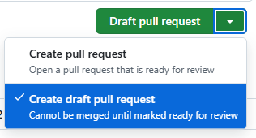

<!---

何を変更したのか、以下について記載してください。
Please describe what has been changed and describe the following.

-->

### Changes/変更内容

- aaaa
- bbbb
- cccc

### Reason or background for the change/変更した理由や背景

- aaaa

### Desired release date and time/リリース希望日時

<!---
Example/例
- 2025-01-01T23:59:00 (JST)

OR/または

- リリース日時の指定はしない
-->

- yyyy-mm-ddThh:mm:ss (JST)

### Create Pull Request/プルリクエストの作成

プルリクエストは `Create Draft Pull Request` を選択すると下書きとして保存できます。
リクエスト内容が完成してから提出してください。

